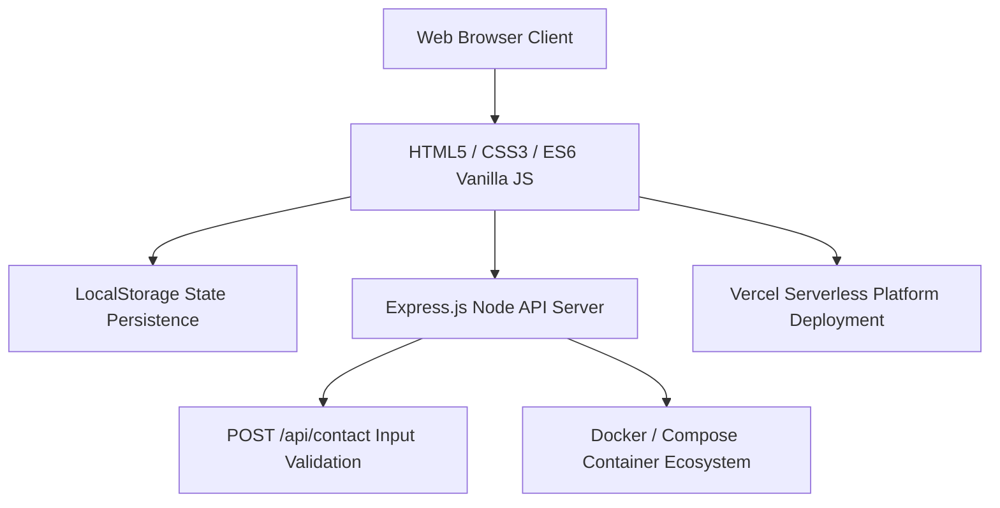

# Furnix Architecture & System Specification

## Overview
Furnix is a modern e-commerce storefront web application designed with a high-contrast neon theme and dynamic client-side interactions. This document outlines the architecture, data flow, component structure, security model, and deployment workflows.



---

## Technical Stack
- **Frontend Architecture**: HTML5 Semantic Markup, CSS3 CSS Variables (Dark/Light Modes), ES6 JavaScript Modules.
- **Backend API**: Node.js & Express.js server providing API endpoints (`/api/contact`).
- **State Management**: LocalStorage fallback with in-memory store for session safety (`furnix_shopping_cart`, `furnix_wishlist`).
- **Tooling & Infrastructure**: Docker containerization (`Dockerfile`, `docker-compose.yml`), GitHub Actions CI (`.github/workflows/ci.yml`), Prettier code formatting.

---

## Key Subsystems

### 1. Storefront Module
- `index.html`, `furniture.html`, `collections.html`, `cart.html`, `wishlist.html`, `search.html`.
- Implements responsive layouts, accessibility skip links, modal dialogs, and skeleton loaders.

### 2. Form & Validation Pipeline
- `form-validation.js`, `contact-form.js`, `toast.js`.
- Manages client-side validation, AJAX API submission, inline error states, and non-blocking toast alerts.

### 3. API & Server Subsystem
- `server.js`: Express server providing JSON body parsing, CORS headers, email format validation, and robust error handling.

### 4. Modular Client Engine Layer
- `scripts/cart-engine.js`, `scripts/cart-calculator.js`: Managed shopping cart and dynamic promo code calculation.
- `scripts/product-modal.js`, `scripts/wishlist-sync.js`: Accessible quickview modals and cross-tab wishlist state synchronizer.
- `scripts/security-sanitizer.js`, `scripts/auth-manager.js`: DOM XSS input sanitization and password strength scoring.
- `scripts/search-engine.js`, `scripts/filter-controller.js`: Fuzzy product text matching and multi-criteria sorting.
- For detailed subsystem specifications, see [STOREFRONT_ARCHITECTURE.md](docs/STOREFRONT_ARCHITECTURE.md).
- For developer API method signatures, see [CLIENT_API_REFERENCE.md](docs/CLIENT_API_REFERENCE.md).

---

## Environment & Deployment Guide

### Local Development
```bash
npm install
npm start
```
The server will start on `http://localhost:5000`.

### Containerized Execution
```bash
docker-compose up --build
```
