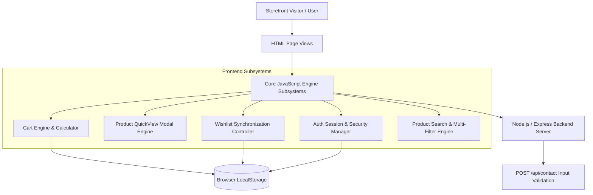

# 📐 Furnix Storefront Architectural Specification

## Overview

Furnix is a modern, high-performance client-side e-commerce web application engineered with modular ES6 JavaScript architecture, robust localStorage state persistence, and responsive neon-themed UI aesthetics.

---

## 🏗️ System Architecture



---

## 🧩 Core Subsystem Breakdown

### 1. Shopping Cart & Dynamic Checkout Engine (`scripts/cart-engine.js`, `scripts/cart-calculator.js`)
- Pure functional calculation of line item totals, tax estimates (8%), flat/threshold shipping rates ($25 under $500, Free over $500), and promotional discount processing (`FURNIX10`, `ECSOC2026`).
- Automatic event propagation over custom DOM events (`furnix:cart-updated`).

### 2. Product QuickView & Wishlist Sync Engine (`scripts/product-modal.js`, `scripts/wishlist-sync.js`)
- Accessible modal dialogs with focus lock, Escape key listeners, keyboard navigation trap, and quantity controls.
- Real-time cross-tab state synchronization through browser `storage` event listeners.

### 3. Security & Auth Session Manager (`scripts/security-sanitizer.js`, `scripts/auth-manager.js`)
- Client-side DOM XSS sanitization preventing malicious script injection.
- Real-time password strength scoring meter (0-4 scale) and unified session controller.

### 4. Search Engine & Multi-Criteria Filtering (`scripts/search-engine.js`, `scripts/filter-controller.js`)
- Client-side fuzzy text query matching, keyword term highlighting (`<mark class="search-highlight">`), price range sliders, and URL state synchronizer.

---

## 💾 Storage Schemas

### Cart State (`furnix_shopping_cart`)
```json
[
  {
    "id": "prod_modern-scandinavian-bed",
    "name": "Modern Scandinavian Bed",
    "price": 1500.00,
    "image": "images/bed.webp",
    "category": "Bedroom",
    "quantity": 1
  }
]
```

### Wishlist State (`furnix_wishlist`)
```json
[
  {
    "id": "prod_luxury-velvet-sofa",
    "name": "Luxury Velvet Sofa",
    "price": 850.00,
    "image": "images/sofa.webp",
    "category": "Living Room"
  }
]
```
